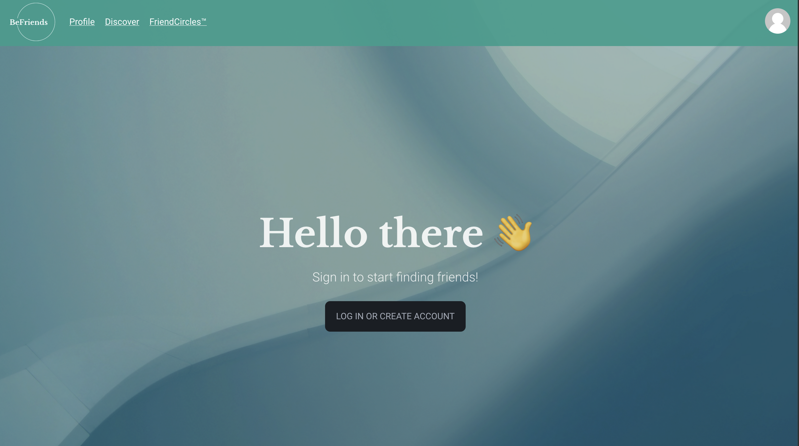
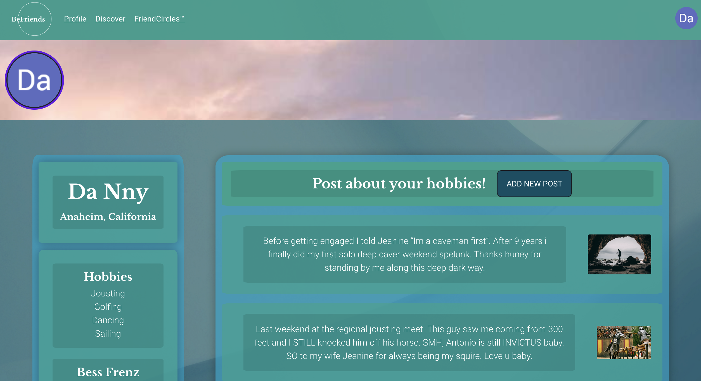
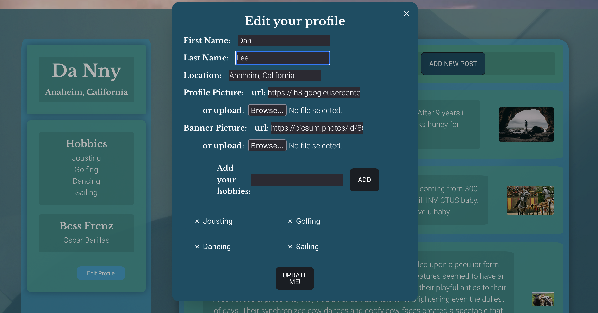
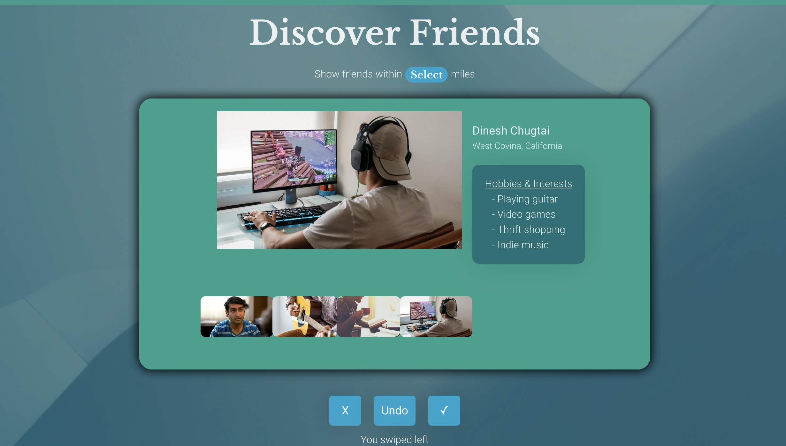
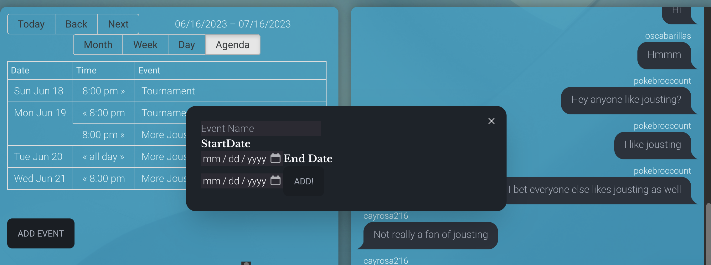
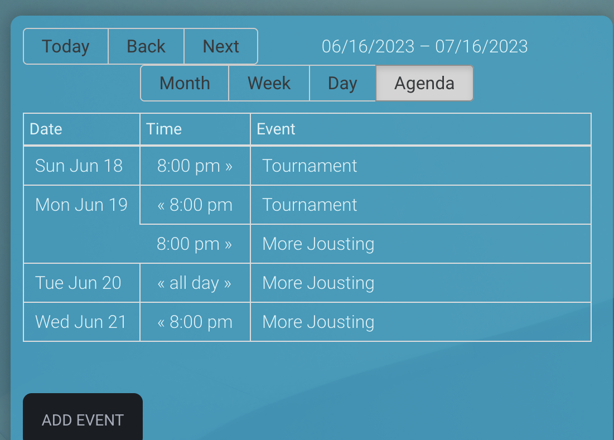
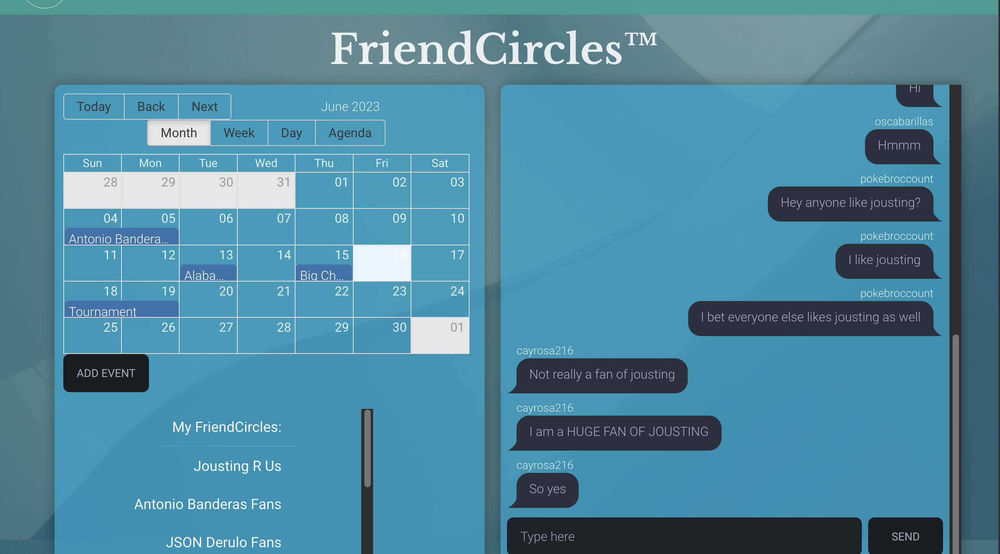

# BeFriends

Table of Contents
- [Description](#description)
- [Features](#features)
   - [Questionnaire and Profile](#questionnaire)
   - [Discover Mode](#discover)
   - [FriendCircle](#friendcircle)
- [Contributions](#contributions)


## Description
BeFriends is a social networking app where users can create FriendCircles based on their interests, join FriendCircles created by other users and chat with them, and find local users with shared interests.

## Features

- **Modern UI**: The application boasts a visually appealing and intuitive user interface, providing a streamlined browsing and chatting experience.
- **Discover Mode**: Look at users in your local area, and add them as a friend if their interests align with yours.
- **FriendCircle Creation and Browsing**: Easily search for and join FriendCircles or create new FriendCircles if there are not any that match your interests.
- **FriendCircle Events**: See what events are happening for people in your FriendCircles and create new events for people in your FriendCircles.
- **Live Chatting in FriendCircles**: Chat with users in your FriendCircles to share questions and comments.
- **Easily Customized Profile**: Add hobbies, interests and photos to your profile to share with other users.


## Questionnaire and Profile



The landing page redirects to Auth0 where to user can either create an account or use their Google account to sign in. If this is the first time the user has visited the site, they will see a questionnaire to fill out basic information such as DOB and hobbies.




After the questionnaire or if the user already has an account, the user will be redirected to their profile page which displays a feed of posts from their FriendCircles. There is also a sidebar where users can see their own hobbies, photos and friends. There is also an edit profile button if the user wishes to update this information.

## Discover Mode



The Discover Mode allows users to filter through users in their local area. The discover mode will show nearby users one at a time after the current user sets a location filter. The current user can see up to five photos uploaded by the users featured in the discover mode, as well as the hobbies of the featured users. The current user has the option to friend the displayed user, or not friend the displayed user. If both users request to be friends with each other, they will show up in each others friend lists, and posts from friended users will appear in the friend feed.

## FriendCircle


The FriendCircle page features the calendar for a user, the FriendCircles they are a part of, a browser for FriendCircles, and chats for FriendCircles. FriendCircles are groups focused around interests that users can create or join. Users can also create events for FriendCircles, and anyone in a FriendCircle is invited to that event.




The calendar displays the events for all the FriendCircles the current user is a part of. Users can create events or edit events that they have created.



Each FriendCircle also has a chat where anyone in a FriendCircle can speak with others in the FriendCircle.

## Installation

Follow these steps to set up the BeFriends project on your local machine:

1. Clone the repository:

   ```
   git clone https://github.com/RFE2303-BeFriends/BeFriends
   ```

2. Install the project dependencies:

  ```bash
  npm install
  ```

## Usage

To start the development server and launch the application, run the following commands:


```bash
npm run server
```

```bash
npm run dev
```

Open your browser and visit [http://localhost:5173](http://localhost:5173) to access the application.


## Technologies Used

- **Front-end**: React
- **Bundling**: Vite, Rollup
- **Styling**: Tailwind, Daisy UI
- **Server**: Express, Auth0
- **Database**: PostgreSQL

## Contributions

This project was created by Neeki Askari, Andre Bagur, Rodrigo Gramitto, Sean Jung and Daniel Leebron in collaboration with Hack Reactor.


